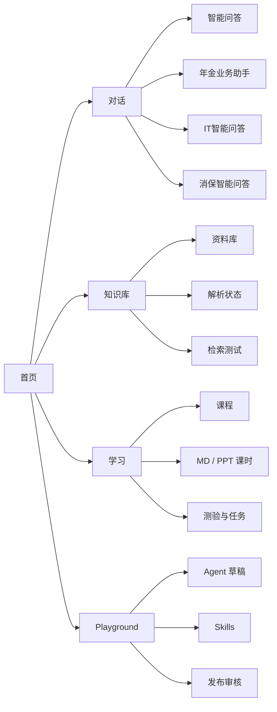
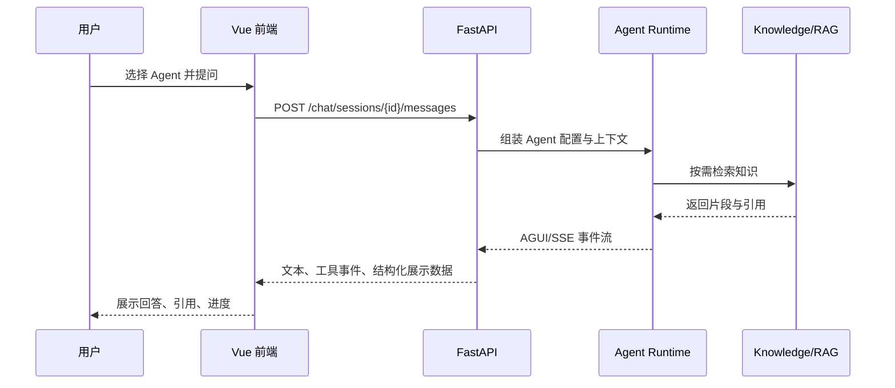

# 养老险GPT 实施规划

## 1. 产品定位

养老险GPT 是面向养老险业务团队的 AI 培训、知识问答与 Agent 创建平台。第一阶段不做泛化 AI 门户，而是围绕四类高频入口组织能力：

- 智能问答：政策、制度、产品、流程随问随答。
- 年金业务助手：方案、纪要、客户话术、材料生成。
- IT智能问答：系统操作、故障处理、流程指引。
- 消保智能问答：风险提示、适当性、留痕、消费者权益保护。

首页只保留“能力入口”和“Playground 即将上线”两块，避免把学习、排行、市场全部塞在首屏。

## 2. 信息架构



## 3. 页面规划

| 页面 | 路由 | 第一阶段内容 | 第二阶段内容 |
| --- | --- | --- | --- |
| 首页 | `/` | 4 个 Agent 入口、Playground Banner | 个性化推荐 |
| 对话 | `/chat` | Agent 列表、会话区、SSE 消息流 | 工具调用轨迹、引用来源 |
| 知识库 | `/knowledge` | 知识库列表、文档上传、解析状态 | 分片预览、检索调试、权限范围 |
| 学习 | `/learning` | 课程列表、课时详情、学习进度 | 测验、作业、证书 |
| Playground | `/playground` | 即将上线页 | Agent 配置、Skills 编排、发布审核 |

## 4. 前端实施

技术栈：Vue 3 + TypeScript + TDesign。

第一阶段组件：

- `AppShell`：顶部栏、左侧导航、主内容布局。
- `HomeView`：当前首页，包含一键唤醒 Agent 和 Playground Banner。
- `AgentCard`：Agent 入口卡片，支持图标、角标、主题色。
- `PlaygroundComingSoon`：Playground 即将上线 Banner。
- `ChatView`：对话页骨架，会话列表 + 消息区。
- `KnowledgeView`：知识库页骨架，文件列表 + 上传入口。
- `LearningView`：学习页骨架，课程卡片 + 课时类型。

响应式原则：

- 宽屏：左侧 Agent 区和右侧 Banner 同行同高。
- 中屏：内容保持两列，Agent 卡片自动换行。
- 窄屏：右侧 Banner 下移，模块自然撑高，禁止裁切文字。

## 5. 后端实施

技术栈：FastAPI + PostgreSQL。

第一阶段 API：

```http
GET  /api/agents/featured
GET  /api/chat/agents
POST /api/chat/sessions
POST /api/chat/sessions/{session_id}/messages
GET  /api/knowledge-bases
POST /api/knowledge-bases/{kb_id}/documents
GET  /api/courses
GET  /api/courses/{course_id}/lessons
```

第二阶段 API：

```http
POST /api/playground/agents
PATCH /api/playground/agents/{agent_id}
POST /api/playground/agents/{agent_id}/test
POST /api/playground/agents/{agent_id}/submit-review
POST /api/playground/agents/{agent_id}/publish
GET  /api/skills
POST /api/skills
POST /api/skills/{skill_id}/versions
```

## 6. 数据模型

核心表：

- `users`：用户。
- `departments`：部门。
- `agent_profiles`：平台内置或用户创建的 Agent。
- `chat_sessions`：会话。
- `chat_messages`：消息。
- `knowledge_bases`：知识库。
- `knowledge_documents`：知识文档。
- `document_chunks`：文档分片。
- `courses`：课程。
- `lessons`：课时。
- `learning_progress`：学习进度。
- `skills`：Skill 主表。
- `skill_versions`：Skill 版本。
- `agent_run_logs`：Agent 运行日志。

## 7. Agent 运行流程



## 8. 里程碑

### M1：首页与导航稳定

- 首页视觉定稿。
- 左侧导航路由接入。
- `/api/agents/featured` 接入首页卡片。

### M2：对话闭环

- 对话页。
- Agent 列表。
- SSE 消息流。
- 基础运行日志。

### M3：知识库闭环

- 知识库创建。
- 文档上传。
- 解析状态。
- 检索测试。

### M4：学习闭环

- 课程列表。
- MD/PPT 课时。
- 学习进度。
- 测验任务。

### M5：Playground

- Agent 草稿配置。
- 能力集与 Skills 选择。
- 调试会话。
- 发布审核。

## 9. 当前下一步

建议下一步先做前端路由和页面骨架：

1. 引入 Vue Router。
2. 抽出 `AppShell`。
3. 把当前首页迁移为 `HomeView`。
4. 增加 `ChatView`、`KnowledgeView`、`LearningView`、`PlaygroundView` 占位页。
5. 左侧导航改为真实路由跳转。
