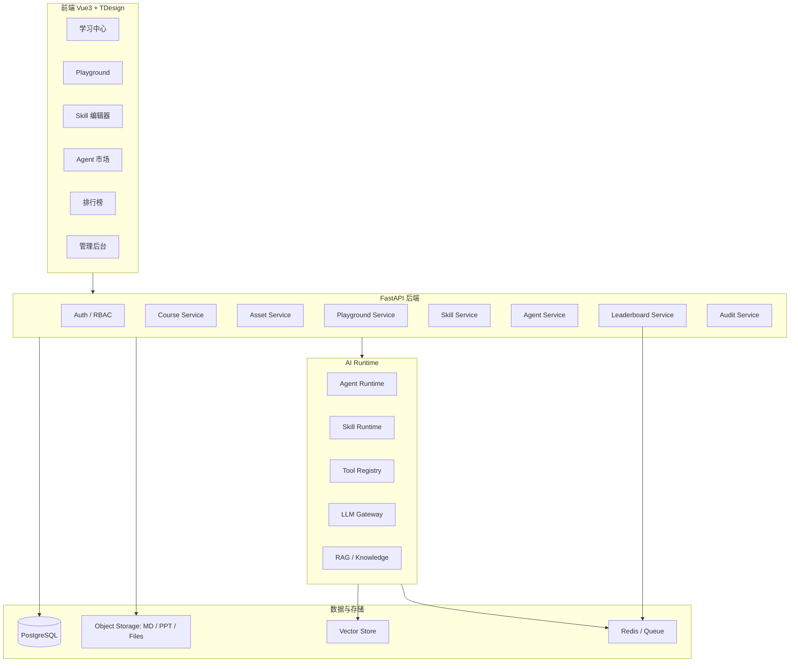
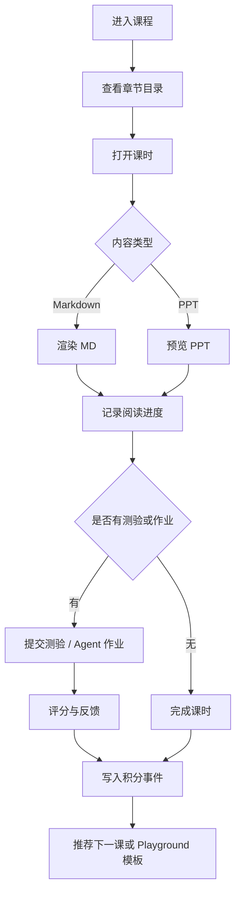
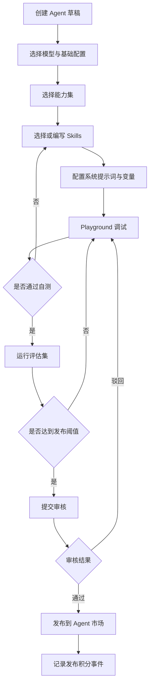
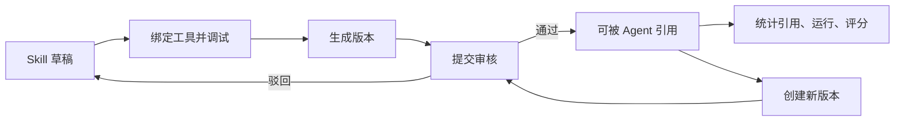
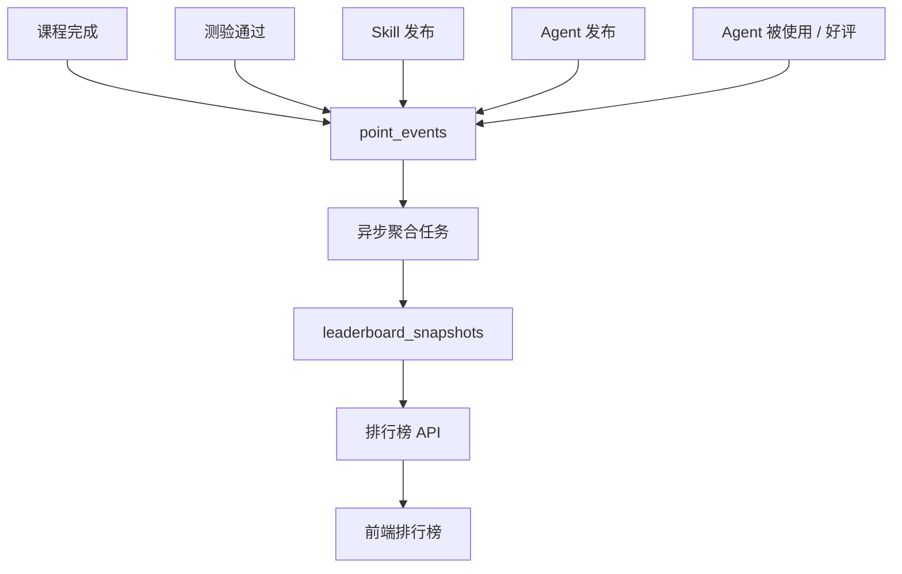

# 公司级 AI 培训平台需求分析与设计

## 1. 背景与目标

建设一个面向企业内部的 AI 培训平台，帮助员工系统学习 AI 能力、完成课程任务、在 Playground 中组合企业已有能力集与自定义 Skills，并将可用 Agent 发布到企业内部使用场景中。

平台技术栈约束：

- 前端：Vue 3 + TypeScript + TDesign
- 后端：Python + FastAPI
- 数据库：PostgreSQL
- 主要内容形态：Markdown + PPT
- 核心功能：学习中心、Playground、Skills/能力集、Agent 发布、排行榜

平台目标不是单纯做课程播放，而是打通“学习 -> 实践 -> 评估 -> 发布 -> 复用 -> 激励”的闭环。

## 2. 用户与角色

| 角色 | 主要目标 | 关键权限 |
| --- | --- | --- |
| 学员 | 学习课程、完成任务、创建 Agent、参与排行 | 查看课程、运行 Playground、提交作品 |
| 讲师 | 创建课程、上传 MD/PPT、布置任务、查看学习效果 | 课程管理、任务管理、成绩查看 |
| Agent 创作者 | 组合 Skills/能力集，调试并发布 Agent | 创建 Skills、创建 Agent、提交审核 |
| 审核员 | 审核 Skills、Agent、课程内容 | 审核、驳回、发布 |
| 管理员 | 维护组织、权限、积分规则、平台配置 | 全局管理 |

## 3. 功能范围

### 3.1 学习中心

学习中心负责课程内容承载和学习进度管理，内容以 Markdown 和 PPT 为主。

核心能力：

- 课程目录：课程、章节、课时三级结构。
- 内容展示：支持 Markdown 渲染、PPT 预览、附件下载。
- 学习进度：记录课时完成状态、阅读时长、最后访问位置。
- 任务与测验：支持课程练习、问答题、选择题、Agent 作业。
- 学习证明：可扩展证书、学习报告、部门统计。
- 与 Playground 联动：课程可以绑定一个 Playground 模板，引导学员学完后直接实践。

### 3.2 Playground

Playground 是平台的核心实践区，允许用户基于企业能力集和自定义 Skills 创建自己的 Agent。

核心能力：

- Agent 创建：名称、描述、头像、模型、系统提示词、能力集、Skills。
- 能力集选择：从平台预置能力集中选择，如 RAG、PPT、Word、数据分析、流程规划等。
- Skill 编辑：支持创建、编辑、版本化 Skill，可绑定工具调用说明。
- 在线调试：对话式测试 Agent，查看运行日志、工具调用、LLM digest、前端展示事件。
- 测试集评估：用预置测试样例评估 Agent 效果。
- 发布流程：草稿 -> 测试 -> 提交审核 -> 发布到企业 Agent 市场。
- 复用与复制：可从公开 Agent fork 出自己的版本。

### 3.3 Skills 与能力集

能力集是平台预置的可复用工具能力组合，Skill 是面向 Agent 的行为指引和调用策略。

设计原则：

- Tool description 收缩为 internal contract，避免让模型把工具当作直接面向用户的产品说明。
- 复杂路由逻辑放到 Skill 中，例如 RAG 路由交给 `rag_retrieval` Skill。
- Skill 负责告诉模型“何时、为什么、如何组合工具”。
- Tool 负责稳定、窄接口、结构化输入输出。
- 前端展示不依赖自然语言 tool_result，而应依赖结构化事件或结构化 digest。

能力集示例：

| 能力集 | 包含能力 | 典型场景 |
| --- | --- | --- |
| RAG 检索 | query rewrite、retrieval、rerank、answer grounding | 企业知识问答 |
| PPT Master | 项目初始化、内容生成、页面编辑、导出 | 汇报材料生成 |
| Word Master | 文档初始化、章节生成、润色、导出 | 制度文档、方案文档 |
| Planning | todo、进度、阶段性汇报 | 复杂任务编排 |
| Data Analysis | 表格读取、统计、图表、解释 | 数据分析训练 |

### 3.4 Agent 市场

Agent 市场用于展示已经发布的企业 Agent。

核心能力：

- Agent 列表、搜索、分类、标签。
- 使用次数、评分、收藏、最近更新。
- 运行 Agent，支持对话、文件输入、结果下载。
- Fork 或复制为自己的 Agent 草稿。
- 反馈与评价。
- 下架、版本升级、变更记录。

### 3.5 排行榜

排行榜用于激励学习与实践，不能只看学习时长，应同时鼓励高质量 Agent 创作。

排行榜维度：

- 学习积分榜：课程完成、测验通过、连续学习。
- 创作积分榜：创建 Skill、发布 Agent、Agent 被使用、获得好评。
- 团队积分榜：按部门、项目组聚合。
- 课程榜：某课程下的完成率、优秀作业。
- Agent 榜：最受欢迎、最高评分、增长最快。

积分事件建议统一进入 `point_events` 表，排行榜使用异步聚合快照，避免每次实时复杂统计。

## 4. 总体架构



## 5. 核心业务流程

### 5.1 学习流程



### 5.2 Agent 创建与发布流程



### 5.3 Skill 生命周期



### 5.4 排行榜积分聚合流程



## 6. 前端设计

### 6.1 页面结构

建议采用企业后台式布局：左侧导航 + 顶部用户区 + 内容工作区。

主要路由：

| 路由 | 页面 | 说明 |
| --- | --- | --- |
| `/courses` | 课程列表 | 按分类、岗位、难度筛选 |
| `/courses/:id` | 课程详情 | 章节、进度、学习入口 |
| `/lessons/:id` | 课时学习 | MD/PPT 阅读、任务提交 |
| `/playground` | Playground 首页 | Agent 草稿、模板、最近运行 |
| `/playground/agents/:id` | Agent 编辑调试 | 配置、Skills、运行日志 |
| `/skills` | Skill 中心 | Skill 列表、版本、审核状态 |
| `/market` | Agent 市场 | 已发布 Agent 使用入口 |
| `/leaderboards` | 排行榜 | 学习、创作、团队、Agent 榜 |
| `/admin` | 管理后台 | 用户、角色、课程、积分规则 |

### 6.2 关键组件

| 组件 | 职责 |
| --- | --- |
| `MarkdownLessonViewer` | 渲染 MD、目录锚点、阅读进度 |
| `PptLessonViewer` | PPT 预览、页码、全屏、进度 |
| `CourseProgressPanel` | 课程完成率、下一步动作 |
| `AgentConfigForm` | Agent 基本配置、模型、参数 |
| `CapabilitySetPicker` | 能力集选择 |
| `SkillEditor` | Skill 内容编辑、版本 diff、测试 |
| `PlaygroundChat` | Agent 对话调试、SSE 展示 |
| `ToolTracePanel` | 工具调用、结构化结果、llm_digest |
| `LeaderboardTable` | 排行榜列表、筛选、周期切换 |

## 7. 后端服务设计

### 7.1 服务模块

| 模块 | 主要职责 |
| --- | --- |
| Auth Service | 登录、SSO、JWT、RBAC |
| Course Service | 课程、章节、课时、进度、任务 |
| Asset Service | MD/PPT/附件上传、预览、版本 |
| Playground Service | 调试会话、运行日志、SSE |
| Skill Service | Skill 创建、版本、审核、引用统计 |
| Agent Service | Agent 草稿、版本、发布、市场 |
| Leaderboard Service | 积分事件、聚合、榜单查询 |
| Audit Service | 内容审核、Agent 审核、操作日志 |

### 7.2 API 设计示例

学习相关：

```http
GET  /api/courses
GET  /api/courses/{course_id}
GET  /api/lessons/{lesson_id}
POST /api/lessons/{lesson_id}/progress
POST /api/lessons/{lesson_id}/complete
POST /api/quiz-attempts
```

Playground 与 Agent：

```http
GET  /api/capability-sets
GET  /api/tools
POST /api/skills
POST /api/skills/{skill_id}/versions
POST /api/agents
GET  /api/agents/{agent_id}
PATCH /api/agents/{agent_id}
POST /api/agents/{agent_id}/test
POST /api/agents/{agent_id}/evaluate
POST /api/agents/{agent_id}/submit-review
POST /api/agents/{agent_id}/publish
```

市场与排行榜：

```http
GET  /api/market/agents
GET  /api/market/agents/{agent_id}
POST /api/market/agents/{agent_id}/run
POST /api/market/agents/{agent_id}/feedback
GET  /api/leaderboards?type=learning&period=weekly
GET  /api/leaderboards/me
```

## 8. 数据模型设计

### 8.1 核心表

| 表 | 说明 |
| --- | --- |
| `users` | 用户 |
| `departments` | 部门 |
| `roles` / `permissions` | 权限 |
| `courses` | 课程 |
| `chapters` | 章节 |
| `lessons` | 课时，关联 MD/PPT 资源 |
| `learning_assets` | 学习资源文件 |
| `learning_progress` | 学习进度 |
| `quizzes` / `quiz_attempts` | 测验与提交 |
| `capability_sets` | 能力集 |
| `tools` | 工具注册信息 |
| `skills` | Skill 主表 |
| `skill_versions` | Skill 版本 |
| `skill_reviews` | Skill 审核 |
| `agents` | Agent 主表 |
| `agent_versions` | Agent 版本 |
| `agent_deployments` | Agent 发布记录 |
| `agent_reviews` | Agent 审核 |
| `agent_run_logs` | 运行日志 |
| `agent_feedback` | 反馈评价 |
| `point_events` | 积分事件流水 |
| `leaderboard_snapshots` | 排行榜快照 |
| `audit_logs` | 审计日志 |

### 8.2 表结构示例

```sql
CREATE TABLE agents (
  id UUID PRIMARY KEY,
  owner_id UUID NOT NULL REFERENCES users(id),
  name TEXT NOT NULL,
  description TEXT,
  status TEXT NOT NULL DEFAULT 'draft',
  visibility TEXT NOT NULL DEFAULT 'private',
  current_version_id UUID,
  created_at TIMESTAMPTZ NOT NULL DEFAULT now(),
  updated_at TIMESTAMPTZ NOT NULL DEFAULT now()
);

CREATE TABLE agent_versions (
  id UUID PRIMARY KEY,
  agent_id UUID NOT NULL REFERENCES agents(id),
  version TEXT NOT NULL,
  model_config JSONB NOT NULL DEFAULT '{}',
  system_prompt TEXT,
  capability_set_ids UUID[] NOT NULL DEFAULT '{}',
  skill_version_ids UUID[] NOT NULL DEFAULT '{}',
  evaluation_summary JSONB NOT NULL DEFAULT '{}',
  created_by UUID NOT NULL REFERENCES users(id),
  created_at TIMESTAMPTZ NOT NULL DEFAULT now()
);

CREATE TABLE point_events (
  id UUID PRIMARY KEY,
  user_id UUID NOT NULL REFERENCES users(id),
  department_id UUID REFERENCES departments(id),
  event_type TEXT NOT NULL,
  points INTEGER NOT NULL,
  ref_type TEXT,
  ref_id UUID,
  metadata JSONB NOT NULL DEFAULT '{}',
  created_at TIMESTAMPTZ NOT NULL DEFAULT now()
);
```

## 9. AI Runtime 与展示协议建议

### 9.1 运行时原则

- 工具返回应分为 LLM 消费通道和前端展示通道。
- LLM 消费通道使用 `llm_digest`，保持短、稳定、面向推理。
- 前端展示通道使用结构化事件，不依赖自然语言文本解析。
- 工具本身只暴露 internal contract，复杂调用策略由 Skill 编排。
- Agent 可以配置默认前端展示模式：`minimal` 或 `detailed`。

### 9.2 前端展示模式

| 模式 | 用途 | 展示方式 |
| --- | --- | --- |
| `minimal` | 普通用户、学习任务、低干扰运行 | 状态条、进度、关键摘要、少量指标 |
| `detailed` | 调试、讲师审核、Agent 创作者 | 工具参数、结构化结果、文件列表、阶段日志、错误详情 |

建议前端不直接展示原始 `tool_call_result`，而是展示结构化 `frontend_digest` 或 AGUI custom event。

结构示例：

```json
{
  "schema": "egis.frontend_digest.v1",
  "tool": "ppt_project_init",
  "status": "success",
  "title": "PPT 项目已创建",
  "summary": {
    "text": "已创建 enterprise_report 项目",
    "metrics": [
      {"label": "目录", "value": "6 个"},
      {"label": "项目名", "value": "enterprise_report"}
    ]
  },
  "views": {
    "minimal": {
      "variant": "status",
      "title": "PPT 项目已创建",
      "subtitle": "enterprise_report",
      "badges": ["project", "ready"]
    },
    "detailed": {
      "sections": [
        {"type": "kv", "title": "项目信息", "items": []},
        {"type": "file_list", "title": "目录结构", "items": []}
      ]
    }
  }
}
```

## 10. 权限与治理

权限建议采用 RBAC + 资源所有者模型：

- 学员只能查看已发布课程和可见 Agent。
- 讲师只能管理自己负责的课程。
- Agent 创建者可以管理自己的草稿和版本。
- 审核员可以审核对应范围内的 Skills、Agent、课程。
- 管理员拥有平台配置与全局数据权限。

必须保留审计日志：

- 课程发布、修改、删除。
- Skill / Agent 审核与发布。
- 权限变更。
- 积分规则变更。
- 重要运行配置变更。

## 11. MVP 分期

### 阶段 1：学习闭环

- 登录、用户、角色、部门。
- 课程、章节、课时。
- Markdown / PPT 学习。
- 学习进度。
- 基础测验。
- 积分事件。
- 学习排行榜。

### 阶段 2：Playground 闭环

- 能力集管理。
- Tool 注册信息展示。
- Skill 创建与版本。
- Agent 创建与调试。
- 运行日志与结构化展示。
- Agent 草稿保存。

### 阶段 3：发布与市场

- Agent 评估集。
- Skill / Agent 审核。
- Agent 市场。
- 使用统计、反馈评分。
- 创作排行榜、团队排行榜。

### 阶段 4：企业化增强

- SSO / LDAP。
- 企业知识库接入。
- 证书体系。
- 运营活动。
- 高级数据看板。
- 多租户或集团组织架构。

## 12. 实施建议

优先把平台做成“学习内容 + Playground 实践 + 排行榜激励”的最短闭环，避免一开始陷入复杂的 Agent 市场治理。

推荐第一版里强约束三件事：

1. 课程必须能绑定 Playground 模板，让学习和实践连起来。
2. Agent 调试必须保留结构化运行日志，后续才能做评估、排行和审核。
3. 积分只从统一 `point_events` 产生，排行榜不直接散落在业务表里计算。

这样后续扩展 Skill 市场、Agent 市场、企业知识库和认证体系时，主干不会推倒重来。
